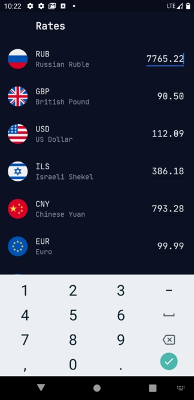

#  Currency converter

### Tasks

- Implement one screen with a list of currencies.
- Use [Api](https://api.exchangeratesapi.io/latest?base=EUR).
- Getting a list of currency and rates.
- Update rates every 30 second.
- Each row has an input where you can enter any amount of money.
- When you tap on currency row it should slide to top and its input becomes first responder.
- When you’re changing the amount the app must simultaneously update the corresponding value for other currencies.
- Additional feature: runtime switching current theme, product flavors, some unit tests for business logic.

### Screenshots

  

### Uses library

- [Dagger2](https://github.com/google/dagger)
- [Okhttp3](https://github.com/square/okhttp)
- [Retrofit](https://square.github.io/retrofit/)
- [Glide](https://github.com/bumptech/glide/)
- [Kotlin Coroutines](https://github.com/Kotlin/kotlinx.coroutines/)
- [Mockk](https://mockk.io/)

### Clean Architecture

There are 3 layers in the project: Data, Domain and Presentation(UI), and the UI layer contains view and presenters (view model).
The modules are parallel and include only the Core module (containing only interfaces and application models).
Communication between modules is established through the App module (Dagger 2).

- Data layer is dispense the required data for the application to the domain layer by implementing interface exposed by the core.
- Domain layer is execute business logic which is independent of any layer.
- Presentation layer is include domain layer and is android specific which executes the UI logic.